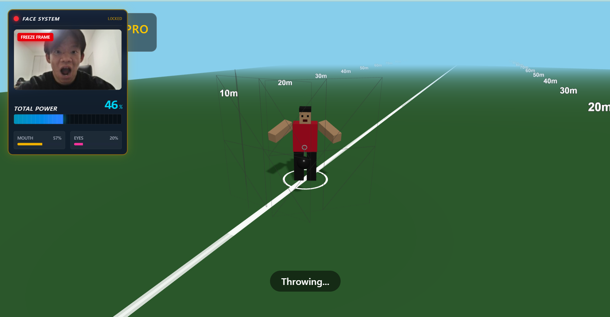

# Hammer Throw Pro

**顔の「表情筋」でハンマーを投げる、新感覚 3D ブラウザゲーム**

Web カメラで取得した表情（口の開き、目の見開き）をリアルタイムに解析し、その「必死さ」をパワーに変換して飛距離を競うスポーツゲームです。
就職活動のポートフォリオとして、モダンな Web 技術（React, Three.js, MediaPipe）の統合と、UX を意識したインタラクションデザインの実践を目的に開発しました。

## 技術スタック (Tech Stack)

このプロジェクトでは、パフォーマンスと開発効率、そして拡張性を重視して以下の技術を選定しました。

| Category        | Technology                                                                                                                                                                     | Reason for Selection                                                                                                                 |
| :-------------- | :----------------------------------------------------------------------------------------------------------------------------------------------------------------------------- | :----------------------------------------------------------------------------------------------------------------------------------- |
| **Frontend**    |   | コンポーネント指向による UI と 3D シーンの分離、型安全性による堅牢なロジック構築のため。                                             |
| **Build Tool**  |                                                                                                    | 高速な HMR により、物理演算やアニメーションの微調整（イテレーション）を効率化するため。                                              |
| **3D Graphics** |                                                                                        | ブラウザ上でリッチな 3D 表現を行うため。React Three Fiber を使わず Native 実装することで、レンダリングループを細かく制御しています。 |
| **Sensing**     |                                                                                        | **Face Mesh**を使用。468 点の顔ランドマークをリアルタイム解析し、微細な表情の変化を入力値として利用するため。                        |
| **Audio**       | **Web Audio API**                                                                                                                                                              | 外部ライブラリに頼らず低遅延なサウンド再生を実現。表情スコアに応じたピッチ/音量の動的変化を実装。                                    |
| **Styling**     |                                                                            | ゲーム画面上の HUD やカットイン演出を、CSS ファイルを行き来せず迅速に構築するため。                                                  |

## アーキテクチャのこだわり

**「入力（顔）」と「出力（3D）」の疎結合設計**

1.  **FaceTracker (Input Layer)**:
    - MediaPipe で表情を解析し、0.0〜1.0 の正規化されたスコアに変換します。
    - カメラ映像の処理とゲームロジックを切り離すことで、将来的な入力デバイスの変更（マウス、音声など）にも柔軟に対応可能です。
2.  **App (State Management)**:
    - スコアを受け取り、ゲームの進行状態（Idle, Throwing, Result）を一元管理します。
3.  **ShotPutScene (View Layer)**:
    - 状態に応じて 3D 空間を描画物理演算します。
    - React のレンダリングサイクルとは独立したアニメーションループを持ち、滑らかな描画を実現しています。

## 主な機能 (Features)

- **リアルタイム表情トラッキング**: 口の開き具合と目の見開き具合を検知し、パワーゲージに反映。
- **ダイナミックな演出**:
  - パワーが 70%を超えると「OVERDRIVE!!」のカットイン演出が発生。
  - チャージ量に応じて効果音のピッチが上昇するインタラクティブサウンド。
- **3D 物理シミュレーション**: 投擲角度とパワーに基づいた放物線運動と、地面との衝突判定。

## インストールと実行 (Getting Started)

`bash

# リポジトリのクローン

git clone https://github.com/iori-sutani/hammer-throw.git

# ディレクトリへ移動

cd hammer-throw

# 依存関係のインストール

npm install

# 開発サーバーの起動

npm run dev

## Author

- **Iori Sutani**
- GitHub: [iori-sutani](https://github.com/iori-sutani)

---
